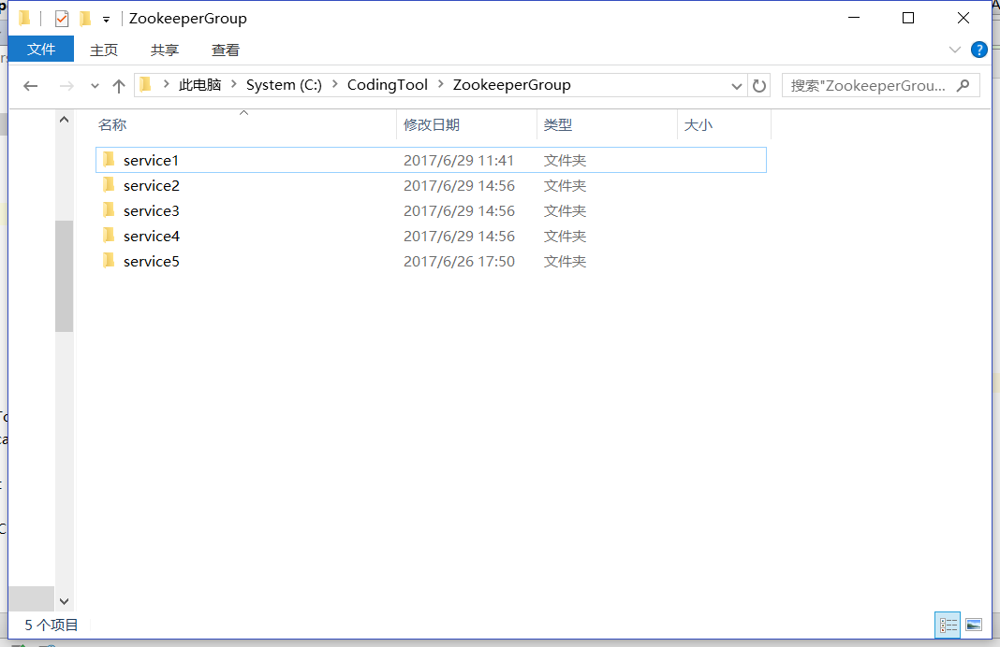
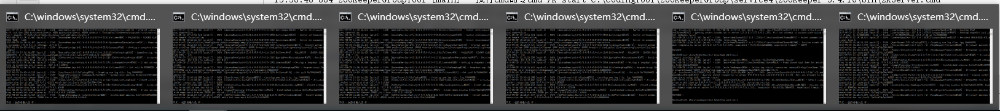

## ZooKeeper集群扩展工具
为了方便本机集群测试 ,自己写了一个工具 ,自动复制ZooKeeper Server并配置到集群中 .也算是重新操练一下Java File .

* PathConfig - 设置集群的各种相关路径 ,实际效果

* ServerConfig - server的host和port设置 ,后面可以配置不同的host来实现真正的集群

* TemplateGenerator - 使用beelt填充模板
* CopyTool - 对文件夹和配置文件的 复制/修改/删除
* ZooKeeperGroupTool - 对本地集群的增删/配置更新/启动

> 主要是对文件的操作 ,因为只是为本地扩展做的 ,没有太大的用处= = (配置更新可以单独出来 ,做成ZooKeeper集群自更新).

